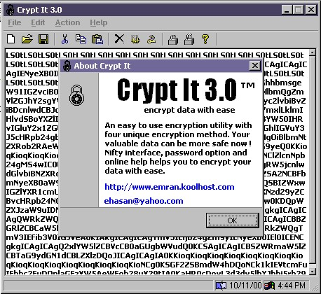



## New Version \! \! \! Crypt It 3\.0 \! \! \!

### Description

The upgraded version of the existing Crypt It 2.0 . Have a kool about box. Now supports four encryption method. A must have
 
### More Info
 

             |
---                |---
**Submitted On**   |2000-10-12 10:18:18
**By**             |[Md Emran Hasan](https://github.com/Planet-Source-Code/PSCIndex/blob/master/ByAuthor/md-emran-hasan.md)
**Level**          |Intermediate
**User Rating**    |3.6 (32 globes from 9 users)
**Compatibility**  |VB 3\.0, VB 4\.0 \(16\-bit\), VB 4\.0 \(32\-bit\), VB 5\.0, VB 6\.0
**Category**       |[Encryption](https://github.com/Planet-Source-Code/PSCIndex/blob/master/ByCategory/encryption__1-48.md)
**World**          |[Visual Basic](https://github.com/Planet-Source-Code/PSCIndex/blob/master/ByWorld/visual-basic.md)
**Archive File**   |[CODE\_UPLOAD1064310132000\.zip](https://github.com/Planet-Source-Code/md-emran-hasan-new-version-crypt-it-3-0__1-12046/archive/master.zip)

